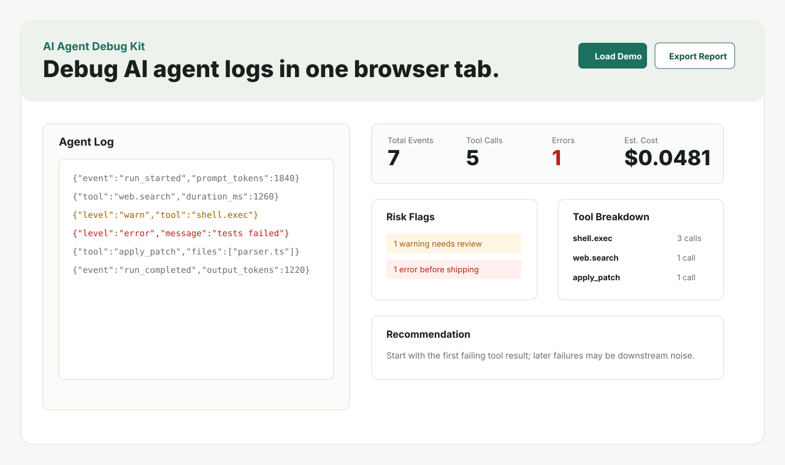

# AI Agent Debug Kit


A zero-dependency browser tool for inspecting AI agent run logs.



## Quick Links

- Demo: https://butianhua4.github.io/ai-agent-debug-kit/
- 48H AI automation rescue offer page: https://butianhua4.github.io/ai-agent-debug-kit/rescue.html
- Fiverr debug service: https://www.fiverr.com/aibuildflow/fix-agent-workflow-errors-and-debug-automation-logs
- Fiverr automation service: https://www.fiverr.com/aibuildflow/build-a-custom-ai-automation-script-for-your-workflow
- Fiverr CI risk gate service: https://www.fiverr.com/aibuildflow/set-up-an-ai-agent-log-risk-gate-for-your-ci-workflow
- 48H revenue sprint commander pack: `sales/COMMANDER_PACK_0.md`
- 48H emergency rescue one-pager: `sales/48h-emergency-rescue-onepager.md`
- Emergency rescue intake form: `sales/client-intake-form.md`
- Emergency rescue reply templates: `sales/triage-reply-templates-cn.md` and `sales/triage-reply-templates-en.md`
- Emergency rescue public posts: `sales/public-posts-cn.md` and `sales/public-posts-en.md`
- Emergency rescue lead tracker: `sales/lead-tracker.csv`
- SAMPLE emergency delivery report: `sales/sample-delivery-report.md`
- Emergency AI automation rescue offer: `docs/EMERGENCY_AI_AUTOMATION_RESCUE_OFFER.md`
- n8n / Make / Zapier automation failure rescue: `docs/AUTOMATION_FAILURE_RESCUE_OFFER.md`
- Automation failure rescue promo pack: `docs/AUTOMATION_FAILURE_RESCUE_PROMO_PACK.md`
- Automation rescue custom offer pack: `docs/CUSTOM_OFFER_AUTOMATION_RESCUE.md`
- Automation failure rescue cover: `assets/automation-failure-rescue-cover.svg`
- Domestic 299 diagnosis cover: `assets/domestic-299-diagnosis-cover.png`
- Domestic 299 diagnosis cover source: `assets/domestic-299-diagnosis-cover.svg`
- Domestic 299 diagnosis proof card: `assets/domestic-299-diagnosis-proof.png`
- Domestic 299 diagnosis proof source: `assets/domestic-299-diagnosis-proof.svg`
- Domestic diagnosis price ladder: `assets/domestic-299-price-ladder.png`
- Domestic diagnosis price ladder source: `assets/domestic-299-price-ladder.svg`
- Domestic 299 diagnosis one-page image: `assets/domestic-299-diagnosis-one-pager.png`
- Domestic 999 repair plan proof card: `assets/domestic-999-repair-plan-proof.png`
- Automation rescue one-page PDF: `assets/automation-rescue-one-pager.pdf`
- Automation rescue demo GIF: `assets/automation-rescue-demo.gif`
- Automation rescue video storyboard: `docs/VIDEO_STORYBOARD_AUTOMATION_RESCUE.md`
- Upload asset checklist: `docs/UPLOAD_ASSET_CHECKLIST.md`
- Visual asset production checklist: `docs/VISUAL_ASSET_PRODUCTION_CHECKLIST.md`
- Chinese automation rescue posting pack: `docs/CHINESE_AUTOMATION_RESCUE_POSTING_PACK.md`
- Domestic outreach scripts: `docs/DOMESTIC_OUTREACH_SCRIPTS.md`
- Chinese buyer intake form: `docs/CHINESE_BUYER_INTAKE_FORM.md`
- Chinese buyer conversion messages: `docs/CHINESE_BUYER_CONVERSION_MESSAGES.md`
- Chinese 299 sample and intake reply: `docs/CHINESE_299_SAMPLE_INTAKE_REPLY.md`
- Chinese 299 30-minute delivery checklist: `docs/CHINESE_299_30_MIN_DELIVERY_CHECKLIST.md`
- Chinese 299 custom offer pack: `docs/CHINESE_299_CUSTOM_OFFER_PACK.md`
- Chinese 299 buyer reply bundle: `docs/CHINESE_299_BUYER_REPLY_BUNDLE.md`
- Chinese 299 quote decision matrix: `docs/CHINESE_299_QUOTE_DECISION_MATRIX.md`
- Chinese 299 to 999 upsell handoff: `docs/CHINESE_299_TO_999_UPSELL_HANDOFF.md`
- Chinese 999 upgrade reply pack: `docs/CHINESE_999_UPGRADE_REPLY_PACK.md`
- Chinese 999 custom offer pack: `docs/CHINESE_999_CUSTOM_OFFER_PACK.md`
- Chinese 1999+ rescue re-scope pack: `docs/CHINESE_1999_RESCUE_RESCOPE_PACK.md`
- Chinese package ladder one-pager: `docs/CHINESE_PACKAGE_LADDER_ONE_PAGER.md`
- Chinese buyer objection handling pack: `docs/CHINESE_BUYER_OBJECTION_HANDLING_PACK.md`
- Chinese offer card copy: `docs/CHINESE_OFFER_CARD_COPY.md`
- Domestic posting bundle: `docs/DOMESTIC_POSTING_BUNDLE.md`
- Chinese 299 domestic listing page: `docs/CHINESE_299_DOMESTIC_LISTING_PAGE.md`
- Chinese 299 Xiaohongshu and Xianyu posts: `docs/CHINESE_299_XHS_XIANYU_POSTS.md`
- Chinese domestic posting schedule: `docs/CHINESE_DOMESTIC_POSTING_SCHEDULE.md`
- Chinese domestic lead scorecard: `docs/CHINESE_DOMESTIC_LEAD_SCORECARD.md`
- Chinese domestic chat reply router: `docs/CHINESE_DOMESTIC_CHAT_REPLY_ROUTER.md`
- Chinese 299 paid order handoff: `docs/CHINESE_299_PAID_ORDER_HANDOFF.md`
- Chinese 299 paid order launch checklist: `docs/CHINESE_299_PAID_ORDER_LAUNCH_CHECKLIST.md`
- Chinese 299 paid order tracker: `docs/CHINESE_299_PAID_ORDER_TRACKER.md`
- Chinese 299 paid order tracker CSV: `docs/examples/chinese-299-paid-order-tracker.csv`
- Chinese first order operator dashboard: `docs/CHINESE_FIRST_ORDER_DASHBOARD.md`
- Chinese first paid order phone runbook: `docs/CHINESE_FIRST_PAID_ORDER_RUNBOOK.md`
- Chinese first order handoff prompts: `docs/CHINESE_FIRST_ORDER_HANDOFF_PROMPTS.md`
- Chinese buyer pre-diagnosis asset copy: `docs/CHINESE_BUYER_PRE_DIAGNOSIS_ASSET_COPY.md`
- Domestic 299 pre-diagnosis material card: `assets/domestic-299-what-to-send.png`
- Domestic 299 sensitive-data safety card: `assets/domestic-299-do-not-send.png`
- Domestic 299 summary card: `assets/domestic-299-summary-card.png`
- CI risk gate cover: `assets/ci-risk-gate-cover.png`
- CI risk gate cover source: `assets/ci-risk-gate-cover.svg`
- CI risk gate pass/block proof card: `assets/ci-risk-gate-sample-proof.png`
- CI risk gate one-page PDF: `assets/ci-risk-gate-one-pager.pdf`
- Chinese 299 eight-image posting caption: `docs/CHINESE_299_EIGHT_IMAGE_POSTING_CAPTION.md`
- Chinese 299 mobile posting checklist: `docs/CHINESE_299_MOBILE_POSTING_CHECKLIST.md`
- Chinese 299 24-hour follow-up cadence: `docs/CHINESE_299_24H_FOLLOW_UP_CADENCE.md`
- Chinese daily lead review checklist: `docs/CHINESE_DAILY_LEAD_REVIEW_CHECKLIST.md`
- Chinese 299 diagnosis one-pager: `docs/CHINESE_299_DIAGNOSIS_ONE_PAGER.md`
- Domestic 299 upload checklist: `docs/DOMESTIC_299_UPLOAD_CHECKLIST.md`
- Domestic lead triage tracker: `docs/DOMESTIC_LEAD_TRIAGE_TRACKER.md`
- Domestic lead tracker CSV: `docs/examples/domestic-lead-tracker.csv`
- Mobile selling status: `docs/MOBILE_STATUS.md`
- Chinese 299 diagnosis report template: `docs/examples/chinese-299-diagnosis-report-template.md`
- Chinese 299 diagnosis sample report: `docs/examples/chinese-299-diagnosis-sample-report.md`
- Chinese 999 repair plan template: `docs/examples/chinese-999-repair-plan-template.md`
- Chinese 999 repair plan sample: `docs/examples/chinese-999-repair-plan-sample.md`
- Portfolio case: automation failure rescue: `docs/PORTFOLIO_CASE_AUTOMATION_FAILURE_RESCUE.md`
- Portfolio case: AI agent CI risk gate: `docs/PORTFOLIO_CASE_CI_RISK_GATE.md`
- CI risk gate proof caption pack: `docs/CI_RISK_GATE_PROOF_CAPTION_PACK.md`
- Fast public bounty screen: `docs/FAST_BOUNTY_SCREEN_2026-05-21.md`
- Fast order opportunity board: `docs/FAST_ORDER_OPPORTUNITY_BOARD_2026-05-21.md`
- Agent + skill pack offer: `docs/AGENT_SKILL_PACK_OFFER.md`
- Agent + skill pack one-pager: `docs/AGENT_SKILL_PACK_ONE_PAGER.md`
- Agent + skill pack cover: `assets/agent-skill-pack-cover.svg`
- Example automation failure log: `docs/examples/webhook-json-mapping-demo-log.jsonl`
- Rescue buyer brief: `docs/RESCUE_BUYER_BRIEF.md`
- CI usage: `docs/CI_USAGE.md`
- CI risk gate one-pager: `docs/CI_RISK_GATE_ONE_PAGER.md`
- CI risk gate buyer reply pack: `docs/CI_RISK_GATE_BUYER_REPLY_PACK.md`
- CI risk gate chat handoff: `docs/CI_RISK_GATE_CHAT_HANDOFF.md`
- CI risk gate buyer intake mini-form: `docs/CI_RISK_GATE_BUYER_INTAKE_MINI_FORM.md`
- CI risk gate buyer FAQ and objections: `docs/CI_RISK_GATE_BUYER_FAQ_AND_OBJECTIONS.md`
- CI risk gate custom offer runbook: `docs/CI_RISK_GATE_CUSTOM_OFFER_RUNBOOK.md`
- CI risk gate custom offer calculator: `docs/CI_RISK_GATE_CUSTOM_OFFER_CALCULATOR.md`
- CI risk gate delivery template: `docs/CI_RISK_GATE_DELIVERY_TEMPLATE.md`
- CI risk gate delivery QA checklist: `docs/CI_RISK_GATE_DELIVERY_QA_CHECKLIST.md`
- Example Markdown report: `docs/examples/sample-report.md`
- Example JSON report: `docs/examples/sample-report.json`
- Example AEO readiness report: `docs/examples/aeo-readiness-sample-report.md`
- AEO JSON report template: `docs/examples/aeo-report-template.json`
- Example AEO JSON report: `docs/examples/aeo-readiness-sample-report.json`
- Emergency rescue report template: `docs/examples/emergency-rescue-report-template.md`
- Automation failure rescue report template: `docs/examples/automation-failure-rescue-report-template.md`
- Portfolio case: AI agent log rescue: `docs/PORTFOLIO_CASE_AGENT_LOG_RESCUE.md`
- Portfolio case promo pack: `docs/PORTFOLIO_CASE_PROMO_PACK.md`
- Portfolio cover: `assets/agent-log-rescue-cover.svg`
- Risk gate workflow: `docs/examples/agent-risk-gate.yml`
- CI risk gate pass/fail sample pair: `docs/examples/ci-risk-gate-sample-pair.md`
- Product page copy: `docs/PRODUCT_PAGE.md`
- Launch status: `docs/LAUNCH_STATUS.md`
- Buyer guide: `BUYER_GUIDE.md`
- Support: `SUPPORT.md`
- Demo script: `docs/DEMO_SCRIPT.md`
- Service offers: `docs/SERVICE_OFFERS.md`
- Fiverr gig packs: `docs/FIVERR_GIG_PACKS.md`
- Fiverr inbox safety: `docs/FIVERR_INBOX_SAFETY.md`
- Fiverr external-link reply pack: `docs/FIVERR_EXTERNAL_LINK_REPLY_PACK.md`
- Fiverr gallery asset audit: `docs/FIVERR_GALLERY_ASSET_AUDIT.md`
- Fiverr upload handoff: `docs/FIVERR_UPLOAD_HANDOFF.md`
- Fiverr operating playbook: `docs/FIVERR_OPERATING_PLAYBOOK.md`
- Fiverr active sourcing: `docs/FIVERR_ACTIVE_SOURCING.md`
- Fiverr portfolio pack: `docs/FIVERR_PORTFOLIO_PACK.md`
- Opportunity pipeline: `docs/OPPORTUNITY_PIPELINE.md`
- Continuous operating mode: `docs/CONTINUOUS_OPERATING_MODE.md`
- Bug report triage offer: `docs/BUG_REPORT_TRIAGE_OFFER.md`
- AI workflow cost audit offer: `docs/AI_WORKFLOW_COST_AUDIT_OFFER.md`
- Quick diagnosis offer: `docs/QUICK_DIAGNOSIS_OFFER.md`
- AEO readiness audit offer: `docs/AEO_READINESS_AUDIT_OFFER.md`
- Chinese AEO readiness listing: `docs/CHINESE_AEO_READINESS_LISTING.md`
- AEO outreach and quote pack: `docs/AEO_OUTREACH_AND_QUOTE_PACK.md`
- AEO delivery checklist: `docs/AEO_DELIVERY_CHECKLIST.md`
- Chinese quick diagnosis listing: `docs/CHINESE_QUICK_DIAGNOSIS_LISTING.md`
- Platform setup: `docs/PLATFORM_SETUP.md`
- Client delivery template: `docs/CLIENT_DELIVERY_TEMPLATE.md`
- Client intake form: `docs/CLIENT_INTAKE_FORM.md`
- Micro product packs: `docs/MICRO_PRODUCT_PACKS.md`
- GitHub release draft: `docs/GITHUB_RELEASE_DRAFT.md`
- Release readiness: `docs/RELEASE_READINESS.md`
- Digital product pack: `docs/DIGITAL_PRODUCT.md`

It accepts JSONL, JSON, or plain-text logs and produces:

- run metrics
- tool-call breakdown
- error and warning flags
- rough token cost estimates
- configurable model pricing
- run A/B comparison with expanded exported metrics
- local snapshot history
- multiple demo scenarios
- model pricing presets
- redacted report export
- SEO and social preview metadata for the public demo
- `robots.txt` and `sitemap.xml` for the public demo
- JSON-LD software application metadata for the public demo
- file import and drag-and-drop log loading, including Run B imports for comparison
- GitHub issue templates for bugs, features, and log-format support
- one-click log clearing
- repeated failure and retry-loop detection
- repeated-pattern section in exported reports
- timestamped Markdown report filenames
- copy-to-clipboard Markdown reports
- copy-to-clipboard JSON reports
- Ctrl/Cmd+Enter report export shortcut
- downloadable JSON reports from the web app
- debugging recommendations
- downloadable Markdown report

## Feature Matrix

| Feature | Web App | CLI | Extension Prototype |
| --- | :---: | :---: | :---: |
| JSONL / JSON / plain-text parsing | Yes | Yes | Yes |
| Pretty JSON and wrapped arrays | Yes | Yes | Yes |
| Tool-call breakdown | Yes | Yes | Basic |
| Cost estimate | Yes | Yes | No |
| Run A/B comparison | Yes | No | No |
| Local snapshot history | Yes | No | No |
| Markdown report export | Yes | Yes | No |
| JSON report output | Yes | Yes | No |
| CI error gate | No | Yes | No |
| Repeated-pattern detection | Yes | Yes | Yes |

## Use

Open `index.html` in a browser, paste logs, or click `Load Demo`.

No server or build step is required.

Snapshots are saved in browser `localStorage`. Logs never leave the browser unless you export and share a report yourself.

## CLI

Generate a Markdown report from a log file:

```bash
node cli.js sample-agent-log.jsonl > report.md
```

Optional flags:

```bash
node cli.js sample-agent-log.jsonl --input-price 1.25 --output-price 10 --no-redact
node cli.js sample-agent-log.jsonl --json > report.json
node cli.js sample-agent-log.jsonl --max-errors 0 --max-warnings 0
node cli.js sample-agent-log.jsonl --fail-on-risk secrets,permission
type sample-agent-log.jsonl | node cli.js --json
```

`--max-errors` exits with code `2` when the report exceeds the allowed error count. `--max-warnings` exits with code `3` when the warning count is too high.
`--fail-on-risk` exits with code `4` when selected risk flags are detected, such as `secrets`, `permission`, `repeated`, or `all`.

More CI examples are in `docs/CI_USAGE.md`.

Full CLI reference: `docs/CLI_REFERENCE.md`.

## Checks

```bash
npm run check
```

## Release Package

```bash
npm run build:release
```

The packaged app is created in `dist/`.

Full preflight:

```bash
npm run preflight
```

Render an AEO JSON report template to Markdown:

```bash
npm run render:aeo
```

GitHub Actions also uploads `ai-agent-debug-kit.zip` as a workflow artifact on each push to `main`.

Release draft: `docs/GITHUB_RELEASE_DRAFT.md`.

## Browser Extension Prototype

The `extension/` folder contains a minimal Manifest V3 popup prototype. See `docs/EXTENSION.md`.

## Supported Log Shapes

JSONL works best:

```json
{"ts":"2026-05-18T09:10:03.200Z","level":"info","event":"tool_call","tool":"shell.exec","duration_ms":1260,"input_tokens":340,"output_tokens":580}
```

The parser also recognizes common fields:

- `ts`, `time`, `timestamp`, `created_at`
- `level`, `severity`
- `event`, `type`
- `tool`, `tool_name`, `name`
- `duration_ms`, `latency_ms`, `elapsed_ms`
- `input_tokens`, `prompt_tokens`
- `output_tokens`, `completion_tokens`

More examples are in `docs/LOG_FORMATS.md`.

## Why It Exists

Agent failures are often hidden in long transcripts. This tool gives developers a quick first-pass view before they open a full trace viewer or incident report.

## Privacy

The app is static and runs in the browser. It does not upload logs or call an external API.

Do not paste secrets into any tool unless you are comfortable storing them in that browser session. Use the exported report only after reviewing it for sensitive data.

## Roadmap

- pricing presets for popular models
- OpenAI Responses API trace import
- richer framework-specific importers
- packaged browser extension icons and screenshots

## Contributing

See `CONTRIBUTING.md`.

## Launch

See `LAUNCH.md` for positioning, launch copy, and product listing material.

## Changelog

See `CHANGELOG.md`.

## Store And Privacy Drafts

- `docs/STORE_LISTING.md`
- `docs/PRIVACY.md`
- `docs/DIGITAL_PRODUCT.md`

## Mobile Progress

See `docs/MOBILE_STATUS.md`.
